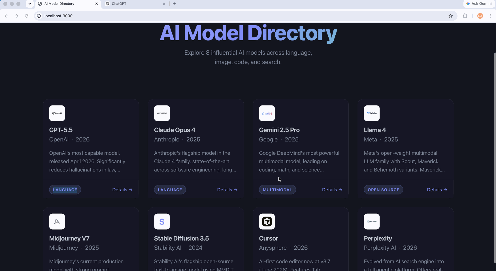

# AI Model Directory

> A listicle web app built for CodePath WEB103 Unit 1.

A directory of influential AI models. Browse models as cards on the home page, click any card to see a full detail view, and the app serves a custom 404 page for any unmatched route. Built with a Node.js + Express backend serving server-rendered HTML, vanilla HTML/CSS/JS on the frontend, and styled with Pico CSS. No frontend framework.

## Tech Stack

- Node.js + Express
- Vanilla HTML/CSS/JavaScript (no frontend framework)
- Pico CSS

## Required Features

- [x] The web app uses only HTML, CSS, and JavaScript without a frontend framework
- [x] Front page of web app is functional and appropriately styled
- [x] The web app displays a title
- [x] Website displays at least five unique list items
- [x] Each list item includes at least three displayed attributes (logo, name, company, etc.)
- [x] Each list item has a corresponding page
- [x] The user can click on each item in the list to see a detailed view of it, including all database fields
- [x] The web app serves an appropriate 404 page when no matching route is defined
- [x] The webpage is styled with Pico CSS

## Stretch Features

- [x] List items are displayed in a unique format (card grid with hover animations)

## Walkthrough



## How to Run

```bash
npm install
npm start
```

Then open http://localhost:3000 in your browser.
